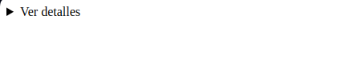
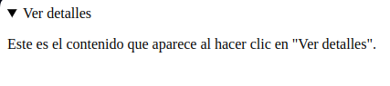
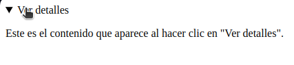
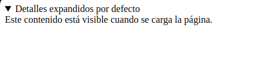

---
header-includes:
  - \usepackage{graphicx}
---

\thispagestyle{empty}

\begin{center}

\Huge{Etiquetas details y summary}

\vspace{1.5cm}

\Large{Víctor Hugo Martínez González}

\vspace{1cm}

\large{Programación web}

\large{Grupo: 8SA}

\vspace{1cm}

\includegraphics[width=0.3\textwidth]{merida.png}

\vspace{1cm}

\large{Fecha de entrega: 24 Octubre 2024}

\end{center}

\newpage


# Etiquetas `<details>` y ``<summary>``

Las etiquetas `<details>` y ``<summary>`` son elementos HTML interactivos que permiten a los desarrolladores crear secciones expandibles y contraíbles en una página web sin necesidad de JavaScript adicional. Estas etiquetas son útiles para mostrar u ocultar contenido de manera dinámica, como información adicional o detalles secundarios.
`<details>`

- La etiqueta `<details>` crea un contenedor que puede ser expandido o contraído por el usuario.
- Dentro de este contenedor se puede incluir cualquier tipo de contenido HTML (texto, imágenes, tablas, etc.).
- Por defecto, el contenido dentro de `<details>` está oculto hasta que el usuario interactúa con él.
- Al hacer clic, el contenido se muestra o se oculta automáticamente.

Ejemplo básico

*html*
```html
<details>
  `<summary>`Información adicional</summary>
  Aquí hay más información que puedes ver al expandir esta sección.
</details>
```


`<summary>`

- La etiqueta `<summary>` se coloca dentro de `<details>` y define el título o encabezado visible que el usuario puede hacer clic para expandir o contraer el contenido.
- Este elemento es opcional, pero si se omite, el contenedor `<details>` aún será funcional, aunque el área de interacción no será tan intuitiva.
- El contenido de `<summary>` siempre es visible, independientemente de si el `<details>` está expandido o no.

**Características adicionales:**

- Accesibilidad: `<details>` y `<summary>` están diseñados para ser accesibles, lo que significa que son compatibles con lectores de pantalla y permiten una navegación fácil a través de teclado.
- Propiedades de estilo: Puedes aplicar CSS para personalizar su apariencia, como cambiar los estilos del texto o añadir iconos para indicar si el contenido está expandido o contraído.

*html*
```html
<details>
  <summary>Ver detalles</summary>
  <p>Este es el contenido que aparece al hacer clic en "Ver detalles".</p>
</details>
```

*css*
```css
summary{
  cursor: pointer;
}
```


**Estado abierto por defecto**

Puedes hacer que `<details>` se muestre expandido por defecto añadiendo el atributo `open`:

*html*
```html
<details open>
  <summary>Detalles expandidos por defecto</summary>
  Este contenido está visible cuando se carga la página.
</details>
```


Usos comunes:

- Preguntas frecuentes (FAQ): Para mostrar respuestas a preguntas.
- Secciones de especificaciones: Mostrar información técnica o descripciones largas de productos.
- Documentación técnica: Para ocultar código o ejemplos largos de forma interactiva.

Estas etiquetas son parte de la especificación de HTML5 y son compatibles con la mayoría de los navegadores modernos.